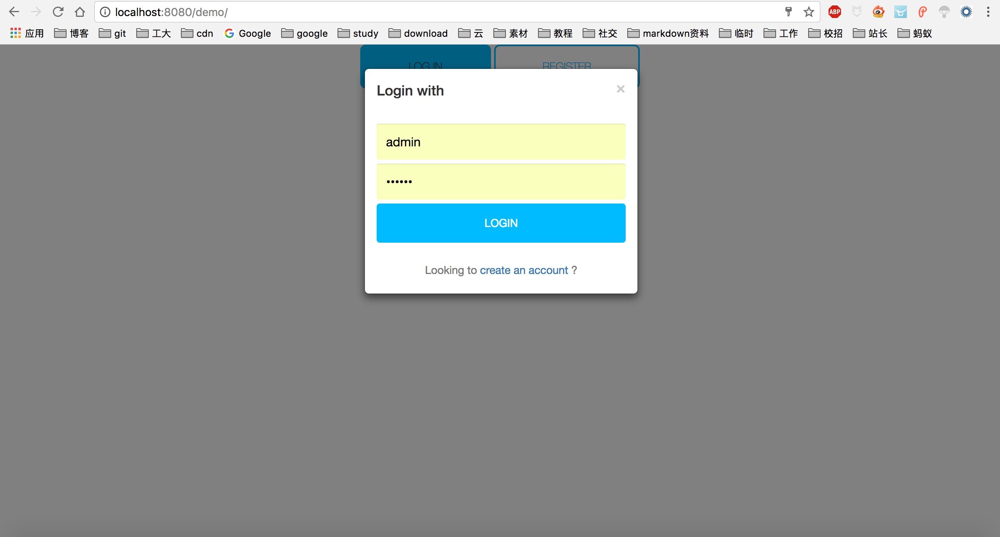
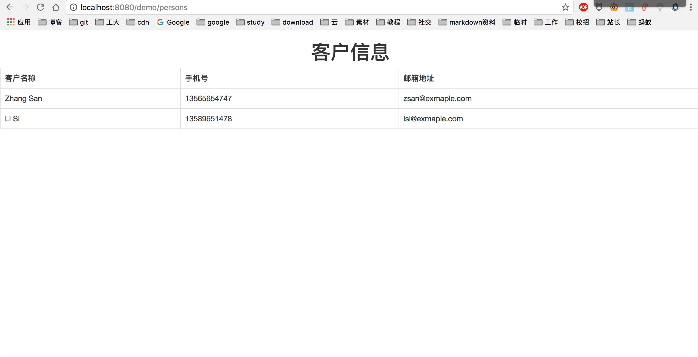

# bfmvc
模仿springmvc的轻量级web框架，适合学习和搭建小型web项目使用，持续更新

上传了 aop 框架。目前还没有测试代码以及注释，近期会补上。
同时，aop 与 web 部分代码有一定的耦合性，后面会进行一次拆分。

# 目录介绍

- bfmvc： 框架源码。
- bfmvc-demo: 基于框架写的一个小demo。
- assest：demo截图。

# 功能

- 支持最基本的mvc模式，提供@Controller,@Service,@Autowired,@RequestMapping四种注解。
- 模仿springmvc，使用DispatherServlet控制路由。
- 支持jsp视图。
- 支持返回json数据。
- 支持自定义资源路径，jsp路径。
- 根据配置，自动扫描包。
- aop支持。

> 项目采用jdk1.8编写，源码中用了1.8新特性。所以1.8以下版本的jdk不支持。

# todo

- 代码提供更多注释。
- 支持多视图。
- 更多。。。

# 如何使用

参考bfmvc-demo。引入bfmvc pom文件（没有放到maven中央仓库，需要引入本地的 bfmvc jar）

执行 mvn clean， mvn install.

将target目录下的xxx.war放到tomcat webapp 目录下， 启动tomcat访问即可。

# 效果（bfmvc-demo）

登录页面（为了演示可以加载本地资源）

persons页面

# 其他
本项目参考了汇智网上的一个项目，从中学到很多。
项目会不定期更新，欢迎关注。
本项目更大的用处是学习spring的思想，而不是要开发一个全新的web框架。
如果有需要，我可以写教程和思路。

